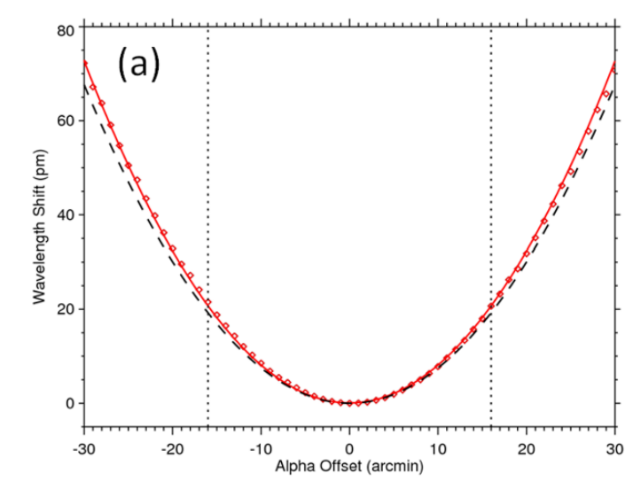
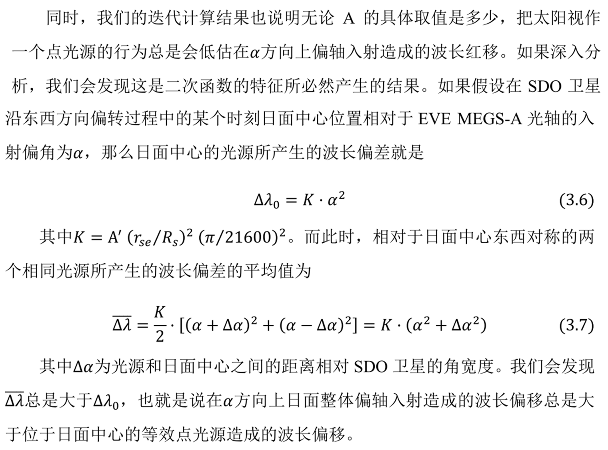
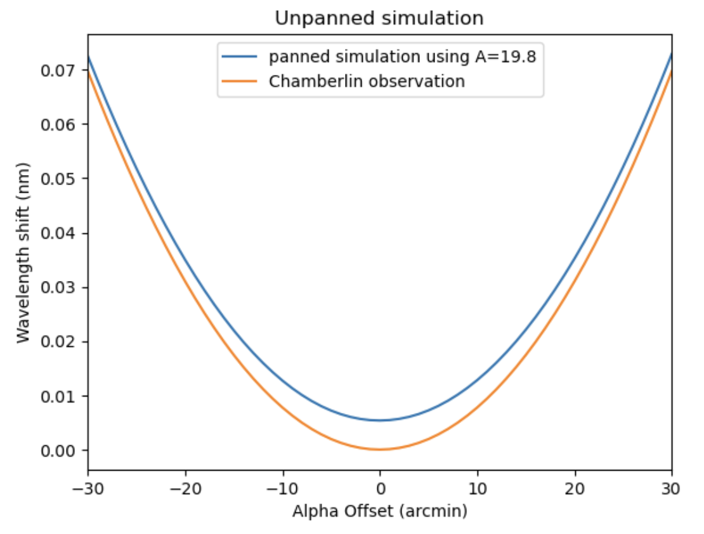
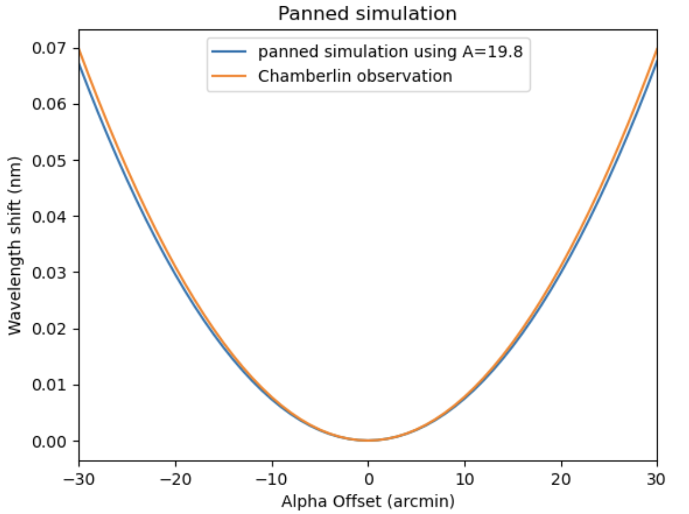
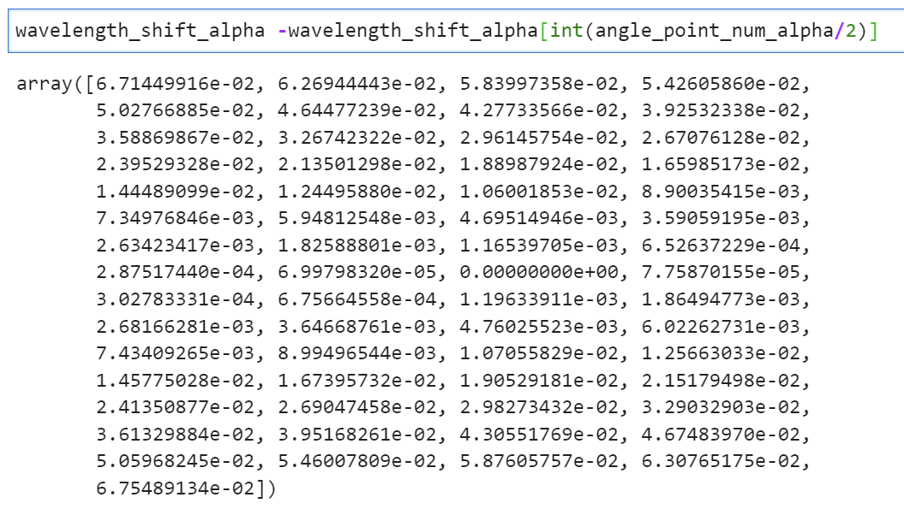

这个文件只用了sunpy map 没有用aiapy 和 IDL

P46 图 3.6 He II 中心波长随入射偏角𝜶和𝜷变化的模拟结果和观测结果

而对于论文P50，对于“为什么A越迭代越大”的解释，我有不同的想法：

1. $\Delta \lambda_0 < \bar{\Delta \lambda}$ 的分析正确

2. 所以未向下平移的蓝线在橙色线上方

   

3. 但是我不理解为什么上述理论说明将蓝色线向下平移后（P46上半部分是指的是平移吧？）蓝色线仍在橙线上方。
   比如我的结果就在下方了。。

   

 

