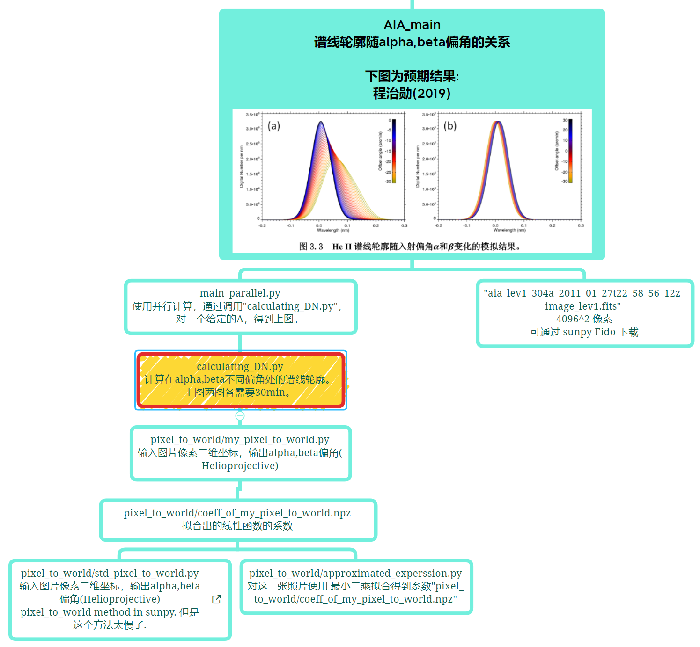
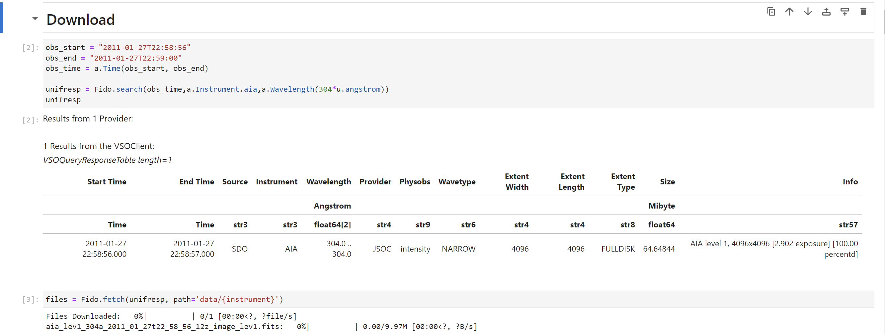
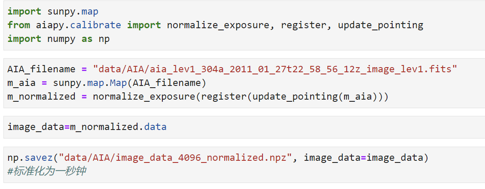
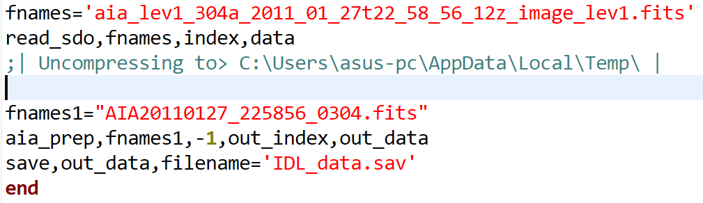
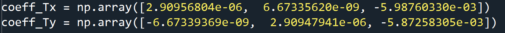
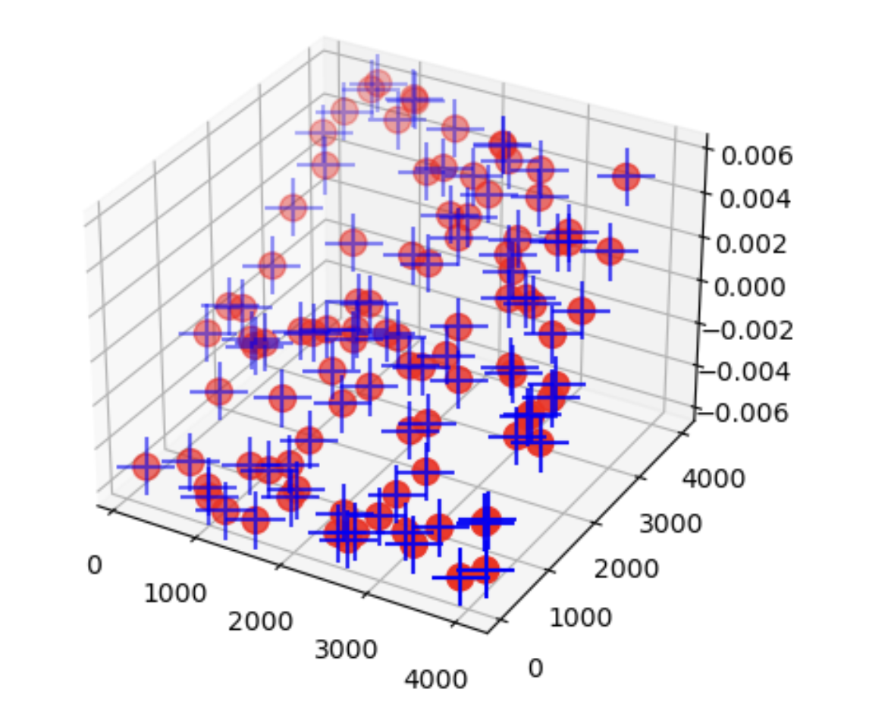
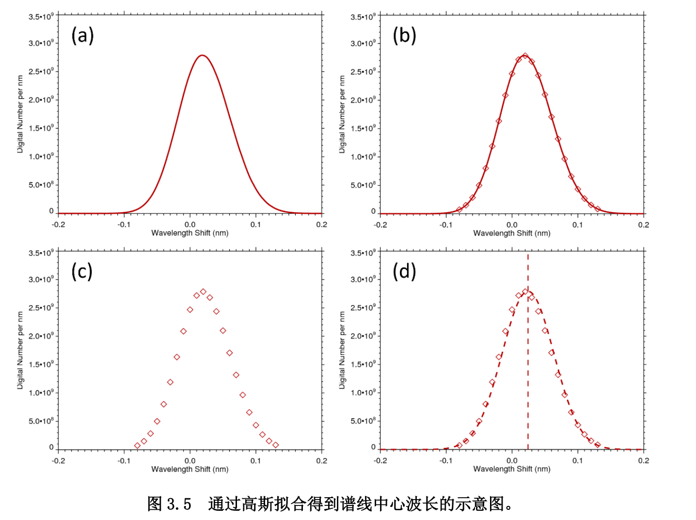

# 结果展示

https://github.com/MaoChengzhi/EVE-spectrum-correction/blob/main/AIA_main/output_visualization.ipynb

# 我主要的疑惑

1. 我得到了P46图3.6右侧beta的结论，但是我的结果P46左侧alpha相反。
2. 不太理解P50上方的理论
3. 我不知道 P43图3.3 中曲线的峰值应该通过如何处理如何得到
4. 我换算出来的系数和 P38 3.2式 中的系数不一样

我做了许多尝试，都未能得到A应该小于19.8的结论

# 主要思路

## P38 3.2

unit_conversion.py

我以3.1式为标准，进行角度换算，得到的3,2系数应分别为

0.077468
0.268966

## 下载图片 

AIA_basics.ipynb

### 使用aiapy对图像进行处理

[Registering and aligning level 1 data — aiapy 0.7.2 documentation](https://aiapy.readthedocs.io/en/stable/generated/gallery/prepping_level_1_data.html)

### 使用IDL对图像进行处理

根据 Guide to SDO Data Analysis

https://www.lmsal.com/sdodocs/doc/dcur/SDOD0060.zip/zip/entry/

## P40 步骤一

calculating_DN_2048.py

$$
Array \ value=Int\ Area\\
=\int_{-\infty}^{\infty} A \ e^{-\frac{(x-x_0)^2} {2\sigma^2}} dx =\sqrt{2 \pi} A \sigma
$$

### 单个高斯分布的 三个参数

~~~python
stddev = 0.1*gaussian_fwhm_to_sigma

amplitude = image_data[pixel_x][pixel_y] / \
                (math.sqrt(2*math.pi)*stddev)

coeff = (amplitude,  # amplitude
        wavelength_shift(Tx, Ty),  # mean
        stddev)

~~~

#### 像素点与偏角的关系

~~~python
Tx, Ty = my_pixel_to_world(2*pixel_x, 2*pixel_y)
#原本函数用于转换4096图片，使用2048图片需要乘2
~~~

##### pixel_to_world/std_pixel_to_world.py
输入图片像素二维坐标，输出alpha,beta偏角([Helioprojective — SunPy 4.1.3 documentation](https://docs.sunpy.org/en/stable/generated/api/sunpy.coordinates.Helioprojective.html))
[AIAMap — SunPy 4.1.3 documentation](https://docs.sunpy.org/en/stable/generated/api/sunpy.map.sources.AIAMap.html#sunpy.map.sources.AIAMap.pixel_to_world) 但是这个方法太慢了。所以，已知像素与角度的转换为线性函数，我通过拟合得到函数关系。

##### pixel_to_world/approximated_experssion.py
对这一张照片，取一些点，最小二乘拟合得到系数"pixel_to_world/coeff_of_my_pixel_to_world.npz"

##### pixel_to_world/validation_check.ipynb

经过随机取点检验，与sunpy内置的pixel_to_world函数相比，相对误差小于1e-4

### 波长范围

-0.1 到 0.25 ，20个点

~~~python
wavelength_point_num = 25
wavelength_list = np.linspace(-0.1, 0.25, wavelength_point_num)
~~~

## P42 步骤四

calculating_DN_2048.py

### alpha，beta偏转角度范围

alpha：-30' 到 30‘  61个点

~~~python
angle_point_num_alpha = 61

offaxis_angle_x_alpha = np.linspace(-math.pi /
                                    360, math.pi/360, angle_point_num_alpha)
~~~

beta: -30' 到 30‘  61个点

~~~python
angle_point_num_beta = 61
DN_beta = np.zeros((angle_point_num_beta, wavelength_point_num))
offaxis_angle_x_beta = np.zeros(angle_point_num_beta)
~~~

