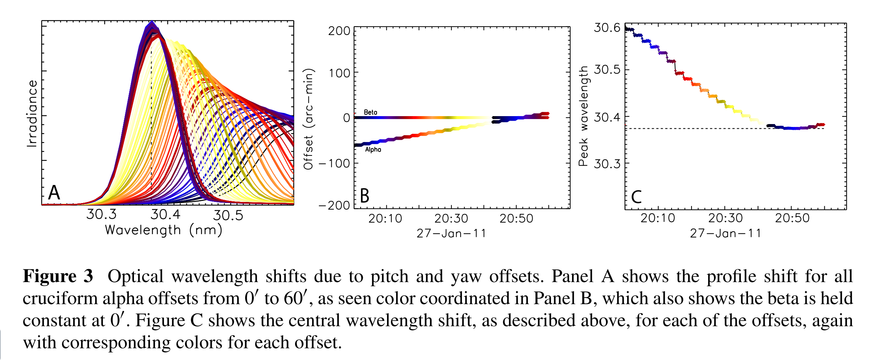
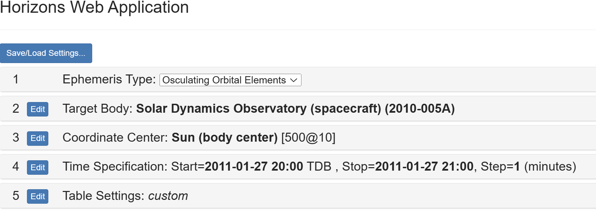
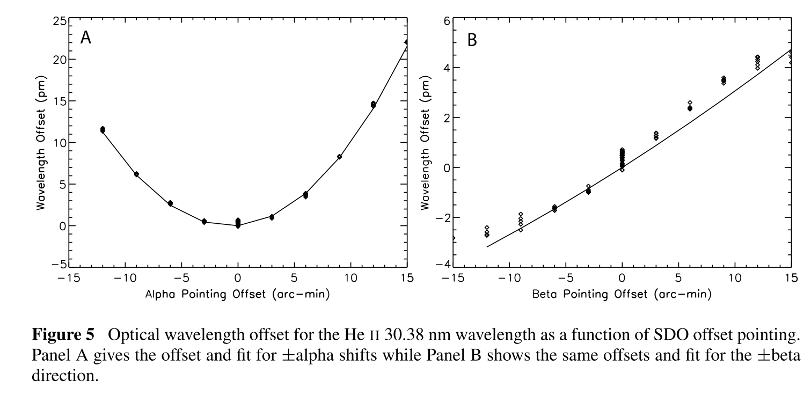
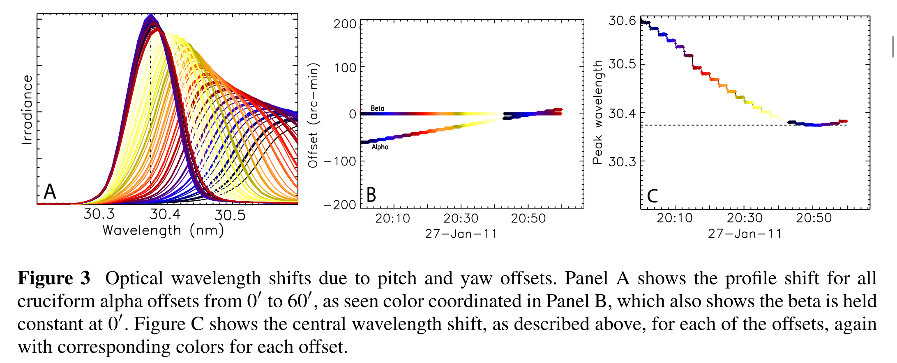

# this folder deals with panel B



### cruciform scan period

[SDO JSOC Calendar (lmsal.com)](https://aia.lmsal.com/public/SDOcalendar.html)


## Attempt

### Using sunpy AIA image 

use several AIA images. sunpy can locate the pixel coordinate of solar disk center.


But 


### Satellite orbit data

#### [Space-Track.Org](https://www.space-track.org/)


Failed. I only find 1 piece of data on 2011-01-27

TLE:

```TLE
1 36395U 10005A   11027.44000130 -.00000035  00000-0  00000+0 0  9993
2 36395 027.9384 183.3973 0002231 322.2601 037.2703 01.00270002  3703
```


#### [Horizons System (nasa.gov)](https://ssd.jpl.nasa.gov/horizons/app.html#/)




| Julian Date (TDB)                  | JDTDB               | 2455589.333333333              |
| ---------------------------------- | ------------------- | ------------------------------ |
|                                    | Calendar Date (TDB) | A.D. 2011-Jan-27 20:00:00.0000 |
| 'Orbital Eccentricity (EC)'        | EC                  | 1.356850066790420E-01          |
| 'Perihelion Distance (QR)'         | QR                  | 1.121596154110891E+08          |
| 'Inclination (IN)'                 | IN                  | 3.941609726344720E+00          |
| 'Longitude of Ascending Node (OM)' | OM                  | 3.074637015381873E+02          |
| 'Argument of Perihelion (W)'       | W                   | 4.984304666822388E+00          |
| 'Perihelion Time (Tp)'             | Tp                  | 2.455447207425500E+06          |
| 'Mean Motion (N)'                  | N                   | 1.411990427647554E-05          |
| 'Mean Anomaly (MA)'                | MA                  | 1.733878840734963E+02          |
| 'True Anomaly (TA)'                | TA                  | 1.749187770806103E+02          |
| 'Semi-Major Axis (A)'              | A                   | 1.297670597846952E+08          |
| 'Apheilion Distance (AD)'          | AD                  | 1.473745041583012E+08          |
| 'Period (PR)'                      | PR                  | 2.549592355238398E+07          |

## 疑问

### Chamberlin(2016)

Figure5 的A的alpha咋才[-13',15'] ？




Figure3 的alpha 都画到-50' 了




进而后文的 Figure8 咋又到了 -27'


### 程志勋(2019)

alpha 为 -30' 到 30'


