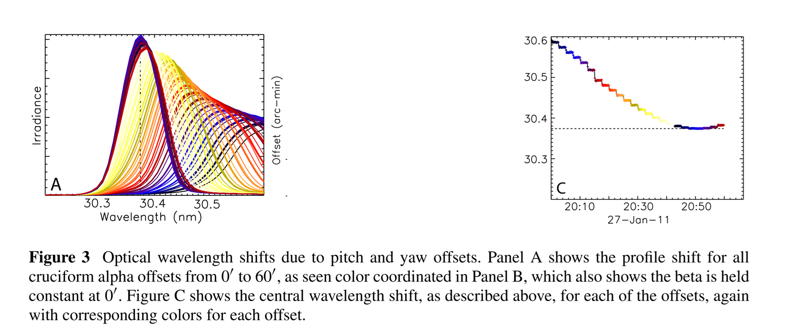
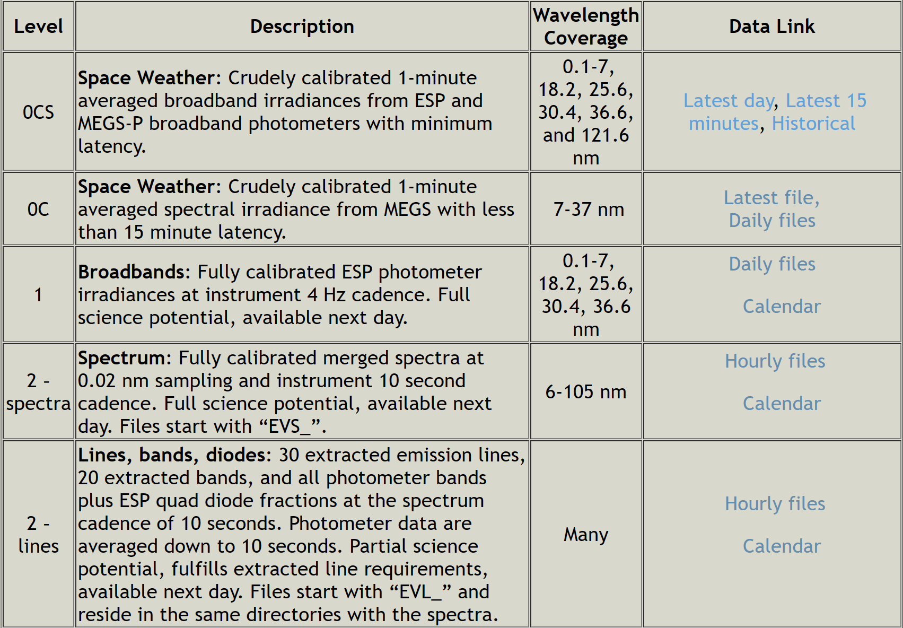

# this folder aims to work out the 2 images:

from *Measuring Solar Doppler Velocities in the He II 30.38 nm Emission Using the EUVVariability Experiment (EVE)*

### Why level2?

### Why use EVS instead of EVL?

panel A requires EVS file instead of EVL.

unit: 

- EVS : W m^-2 nm^-1 
- EVL : W m^ - 2

so the file is "EVS_L2_2011027_20_007_02.fit.gz"