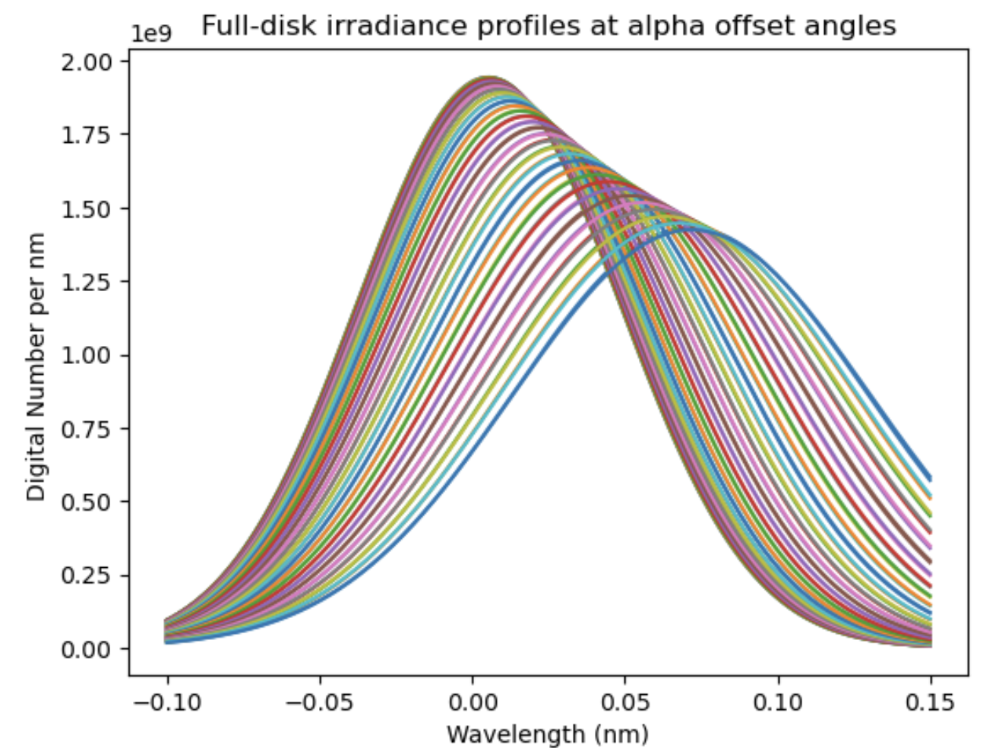
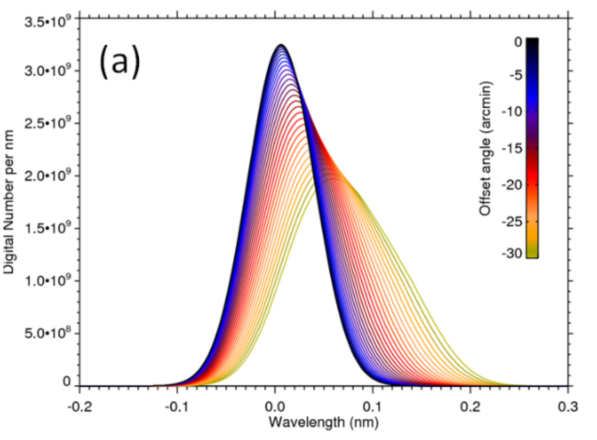

# EVE-spectrum-correction
复现《基于 SDO/EVE光谱观测对太阳大气等离子体运动的研究》第三章   ||   Reproduce results of "Correcting Doppler Shifts in He II 30.38nm Line by Using the EVE and AIA Data from Solar Dynamics Observatory"

# 复现时与论文主要不同

## 谱线轮廓峰值

- 我使用sunpy resample 得到2048^2像素的图片

- 我使用4096^2像素的图片

  峰值是论文中 7.77/3.25=2.39 倍.

  - gaussian_fwhm_to_sigma^(-1)=2.35
  - $\sqrt{2\pi}\approx 2.506$

- 论文P43

## 中心波长随入射偏角𝜶和𝜷变化的模拟结果和观测结果

这导致论文中的修正是变小，我的修正是变大

- 我使用2048^2图片
  我的蓝线模拟在橙线下方

- 论文P46
  下图：红色模拟在观测黑虚线上方

