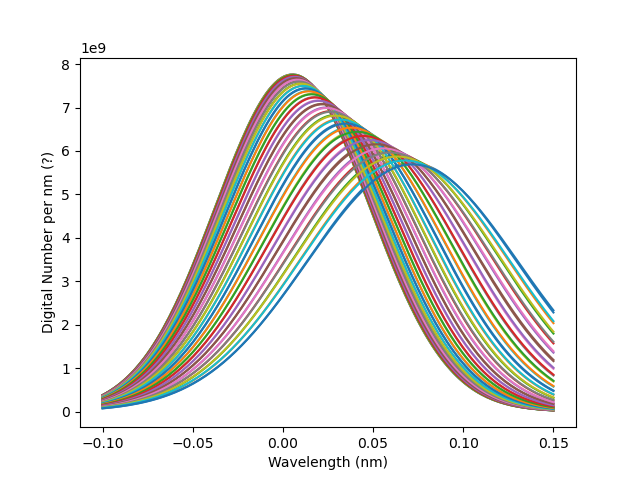
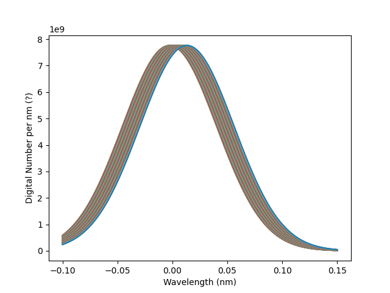
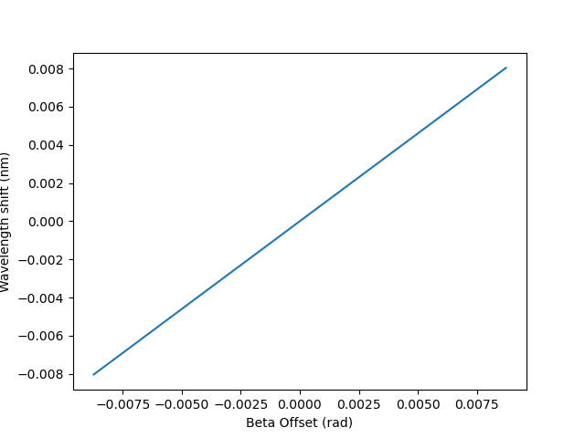
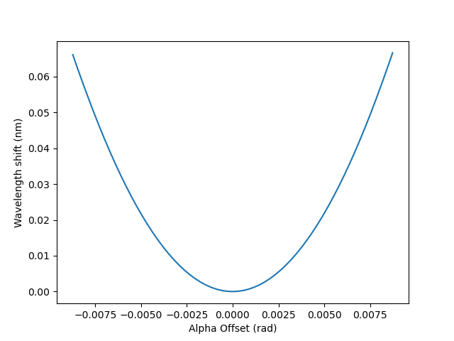
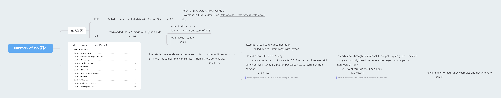

# EVE-spectrum-correction
复现《基于 SDO/EVE光谱观测对太阳大气等离子体运动的研究》第三章   ||   Reproduce results of "Correcting Doppler Shifts in He II 30.38nm Line by Using the EVE and AIA Data from Solar Dynamics Observatory"

# 复现论文

## AIA

下载数据: 三种方法都可以

1. sunpy      Fido.fetch
2. [JSOC Lookdata (stanford.edu)](http://jsoc.stanford.edu/ajax/lookdata.html)
3. [VSO client - 搜索 (virtualsolar.org)](https://sdac.virtualsolar.org/cgi/search)

使用 level0 4096^2 的图片尝试复现。文中使用的是2048^2的图片，但是我不知道论文中图片是如何得到的。结果有较大出入。

运行main.py 13h 得到DN.py

### He II 谱线轮廓随入射偏角𝜶和𝜷变化的模拟结果

对应论文中P61 图3.3

峰值是论文中3.4倍

### He II 中心波长随入射偏角𝜶和𝜷变化的模拟结果

对应论文中P64 图3.6

论文中模拟结果大于观测结果，我的模拟结果甚至小于观测结果，差距很大。

## EVE

下载数据:

1. [JSOC Lookdata (stanford.edu)](http://jsoc.stanford.edu/ajax/lookdata.html)
2. [VSO client - 搜索 (virtualsolar.org)](https://sdac.virtualsolar.org/cgi/search)

根据https://github.com/sunpy/sunpy/issues/2407这个帖子，sunpy目前不支持EVE level2， 所以刚开始学习IDL。

## 寒假总结

Python入门:

https://www.mubucm.com/doc/6G-gR0Plyzm

