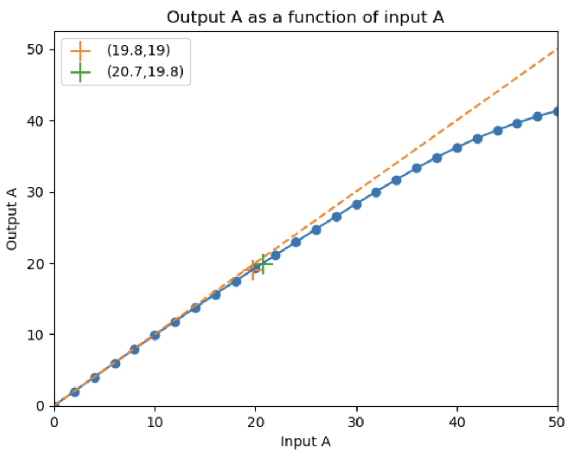

# EVE-spectrum-correction
复现《基于 SDO/EVE光谱观测对太阳大气等离子体运动的研究》第三章   ||   Reproduce results of "Correcting Doppler Shifts in He II 30.38nm Line by Using the EVE and AIA Data from Solar Dynamics Observatory"

# EVE部分不必要

我一开始是想找到 波长-时间，偏角-时间的关系，进而得到波长-偏角的关系。

我在邮件中向程治勋请教后知道了，这些数据基本都没公开。

第三章用到的EVE扫描期间的结论应该只有Chamberlin(2016):
$$
\Delta \lambda=19.8\sin^2 \phi+4.3\sin\theta
$$

# 复现时与论文主要不同

我觉得用这种图，可以同时定性分析“迭代法”与MSE法

## 谱线轮廓峰值

- 我使用sunpy resample 得到2048^2像素的图片

- 我使用4096^2像素的图片

  峰值是论文中 7.77/3.25=2.39 倍.

  - gaussian_fwhm_to_sigma^(-1)=2.35
  - $\sqrt{2\pi}\approx 2.506$

- 论文P43

## 中心波长随入射偏角𝜶和𝜷变化的模拟结果和观测结果

这导致论文中的修正是变小，我的修正是变大

- 我使用2048^2图片
  我的蓝线模拟在橙线下方

- 论文P46
  下图：红色模拟在观测黑虚线上方

## P48 3.4中的系数21600

我觉得是10800?
