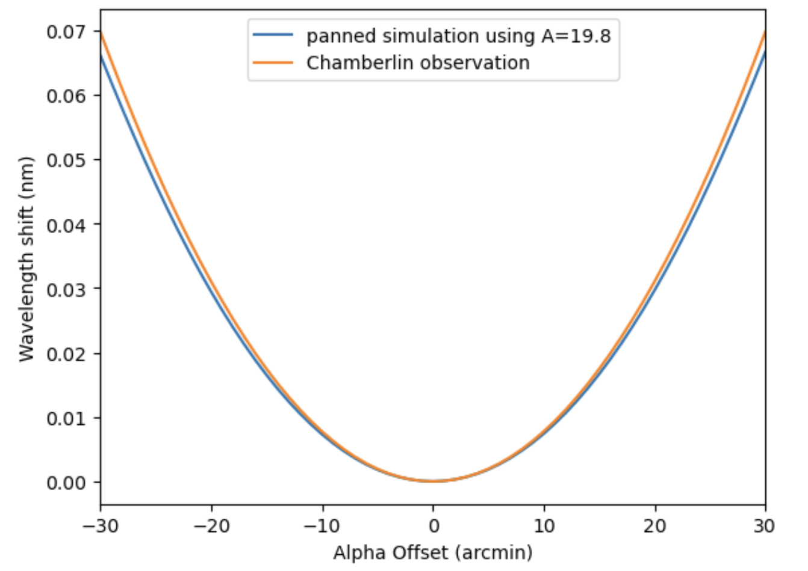
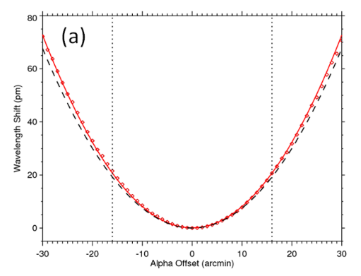
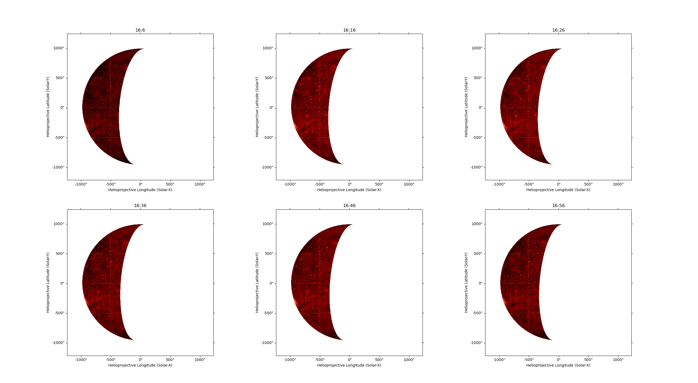
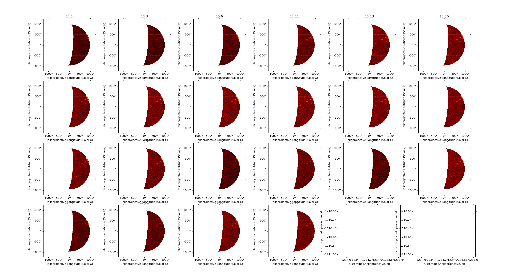
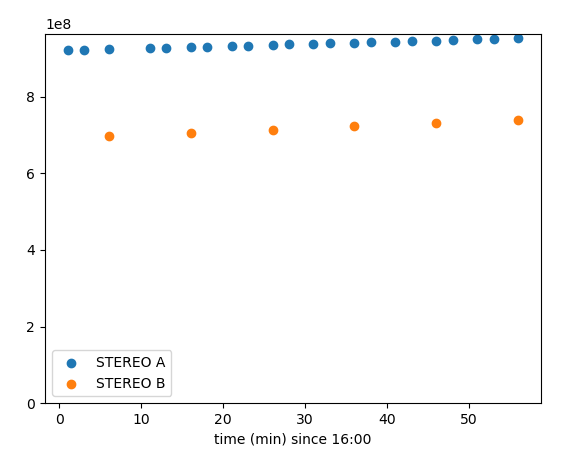
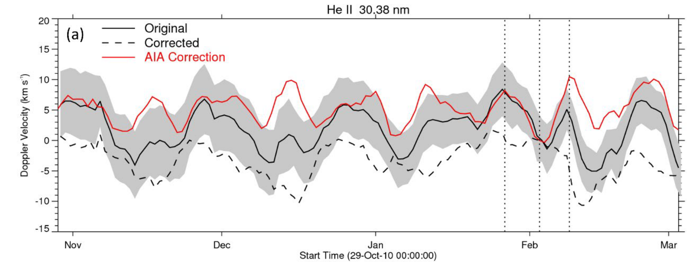

# EVE-spectrum-correction
复现《基于 SDO/EVE光谱观测对太阳大气等离子体运动的研究》第三章   ||   Reproduce results of "Correcting Doppler Shifts in He II 30.38nm Line by Using the EVE and AIA Data from Solar Dynamics Observatory"

# Chapter 3

第三章用到的EVE扫描期间的结论只有Chamberlin(2016):
$$
\Delta \lambda=19.8\sin^2 \phi+4.3\sin\theta
$$

## 中心波长随入射偏角𝜶和𝜷变化的模拟结果和观测结果

这导致论文中的修正是变小，我的修正是变大

- 我使用2048^2图片
  我的蓝线模拟在橙线下方

- 论文P46
  下图：红色模拟在观测黑虚线上方

### beta方向扫描曲线变矮的原因？

STEREO A

STEREO B

beta方向扫描期间，根据STEREO，EUVI 30.4nm 波段 计算SDO视野内亮度

# Chapter 4

