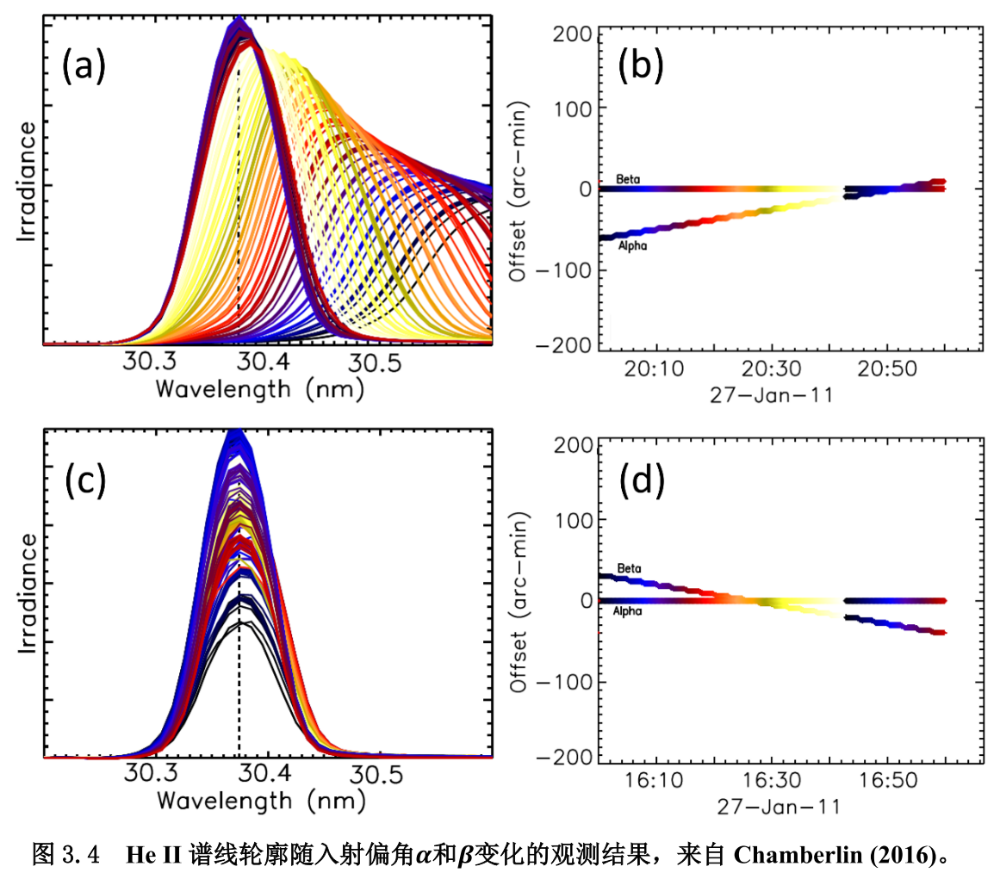
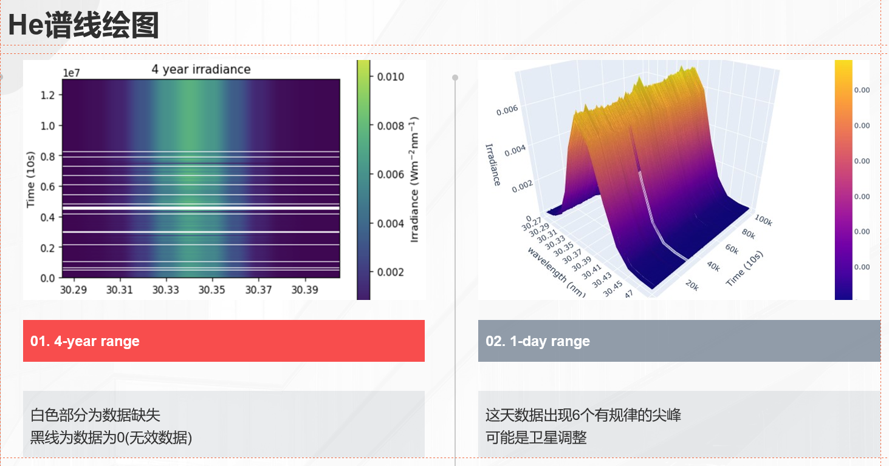
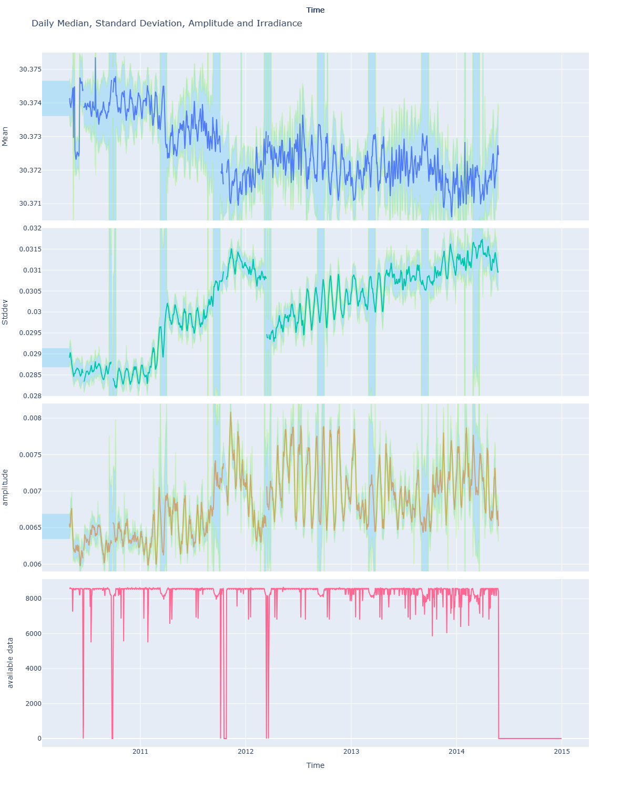
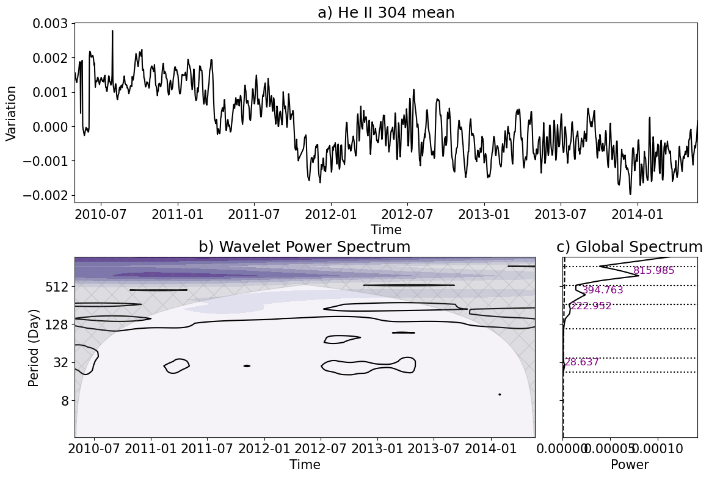
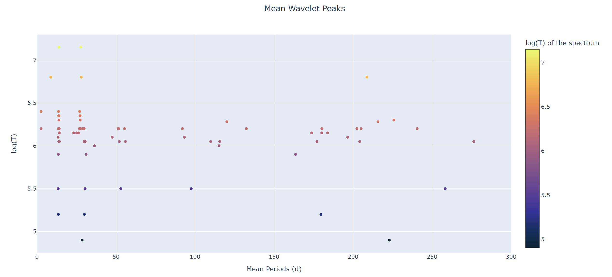

# EVE-Spectrum-Correction
Verification of the major results in [Cheng et al., 2021]

- Calibration of cruciform scan for EVE
- Long-term spectral observation by EVE

---

# Chapter 3

### Input Data for Cruciform Scan
Due to the limited data available, the only input data during the cruciform scan is from Chamberlin (2016):
$$
\Delta \lambda = 19.8\sin^2 \phi + 4.3\sin\theta
$$

---

### Simulation and Observation of Central Wavelength Changes with Incident Angles (𝛼 and 𝛽)

This leads to a difference in corrections: the paper's correction results in a decrease, while my correction results in an increase.

- I used 2048^2 resolution images.  
  My simulation (blue line) lies below the orange line.

- From the paper (P46):  
  In the figure below, the red simulated line is above the black dashed observational line.

---

### Why Does the Scanning Curve in the Beta Direction Become Flatter?

The total solar radiation during the scan period did not vary significantly, so it is likely caused by the slit blocking the incident light. However, the drop in panel (c) cannot be explained.

Since specific details about the slit are unknown, further analysis cannot continue in this direction. Therefore, long-term Doppler analysis was performed instead.

#### STEREO A:

#### STEREO B:

During the beta-direction scan, the brightness of the SDO field of view was calculated for the EUVI 30.4 nm band based on STEREO. No significant changes were observed.

---

# Chapter 4

### From the Paper:
Expected dashed line: the corrected line is a horizontal straight line.

---

## Overview of EVE Data

_Shadow_: 3× standard deviation region of mean/amplitude/standard deviation for 8640 data points per day.

---

## AIA simulation v.s. EVE observation

AIA simulation v.s. EVE observation

-1686219585220-3.png)

AIA simulation v.s. EVE observation

.png)

# Long term Observation

Wavelet transform of He II line central parameter.

Peak period in the Wavelet transform of various EVE spectral lines with respect to line temperture.

