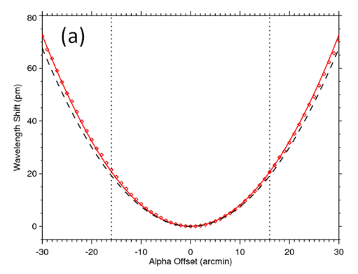

# EVE-spectrum-correction  
Verify the major results in [Cheng et al., 2021]

- Cruciform scan calibration for EVE

- EVE long term spectra observation

# Chapter 3

Due to limited data available, the only input data during the cruciform scan isChamberlin(2016):
$$
\Delta \lambda=19.8\sin^2 \phi+4.3\sin\theta
$$

## 中心波长随入射偏角𝜶和𝜷变化的模拟结果和观测结果

这导致论文中的修正是变小，我的修正是变大

- 我使用2048^2图片
  我的蓝线模拟在橙线下方

- 论文P46
  下图：红色模拟在观测黑虚线上方

### beta方向扫描曲线变矮的原因？

扫描期间太阳总辐射没有大变化，应该是入射的狭缝挡住了。无法解释（c）图中的下降。

但是具体狭缝细节不可知，故无法继续沿此继续分析。故进行长期多普勒分析

STEREO A

STEREO B

beta方向扫描期间，根据STEREO，EUVI 30.4nm 波段 计算SDO视野内亮度，可以看出没什么变化

# Chapter 4

论文中：

期望虚线：修正后的线 为水平直线

## EVE数据概览

shadow: 3*stddev region of mean/amplitude/stddev  of 8640 data per day

## AIA数据概览

把4年，每天一张的AIA图片输出到一个pdf里面了

-1686219585220-3.png)

.png)
