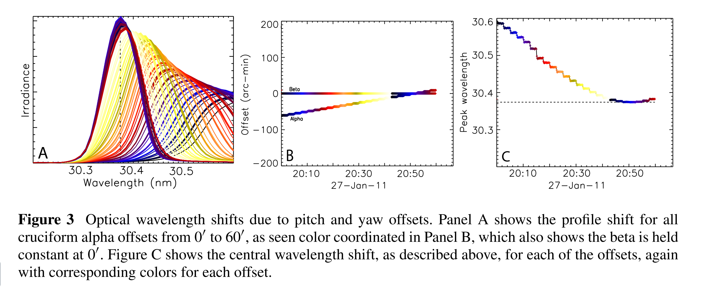
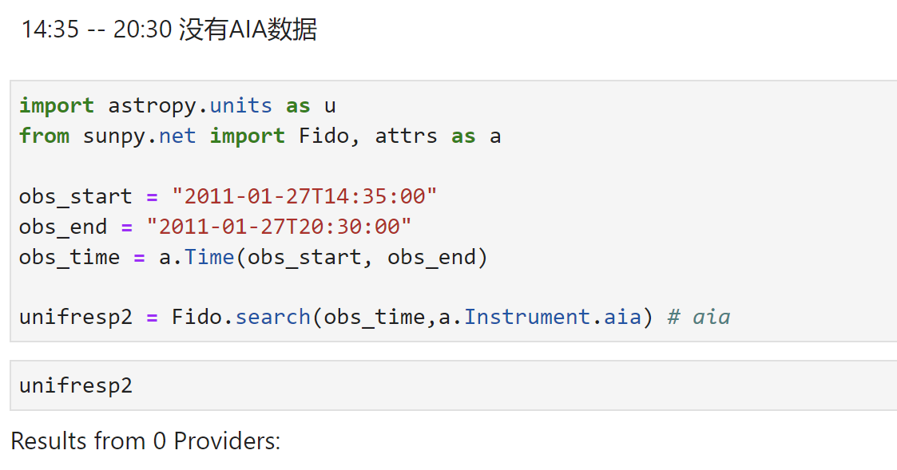
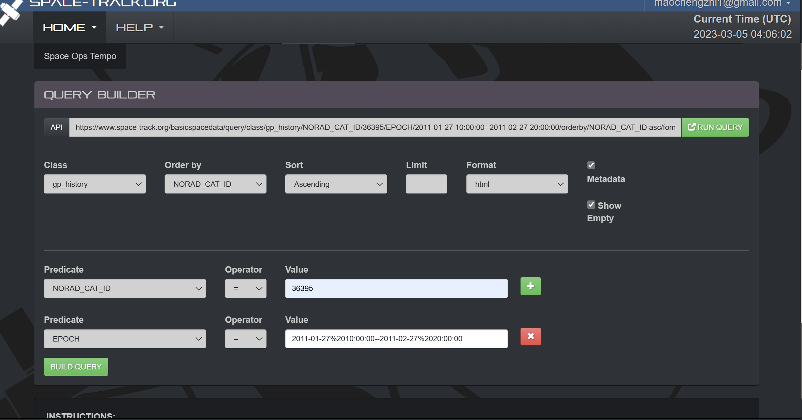
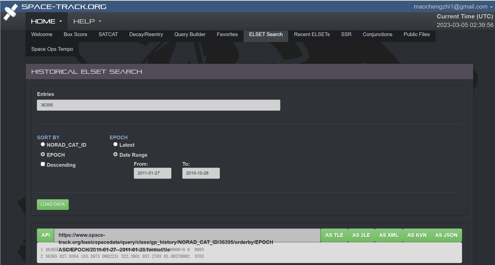
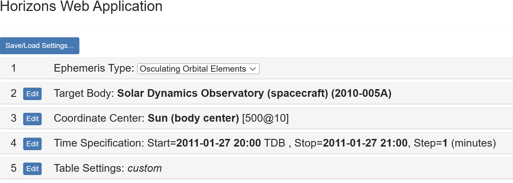

# this folder deals with panel B



## Attempt

### Using sunpy AIA image 

use several AIA images. sunpy can locate the pixel coordinate of solar disk center. But 



### Satellite orbit data

#### [Space-Track.Org](https://www.space-track.org/)




Failed. I only find 1 piece of data on 2011-01-27

TLE:

```TLE
1 36395U 10005A   11027.44000130 -.00000035  00000-0  00000+0 0  9993
2 36395 027.9384 183.3973 0002231 322.2601 037.2703 01.00270002  3703
```


#### [Horizons System (nasa.gov)](https://ssd.jpl.nasa.gov/horizons/app.html#/)



