## assignment

先把第四章重现

再说他哪里有问题


认为修正后为一条直线

Doppler 怎么可以给修正掉？？？

该图为耀斑期间的动力学图谱：

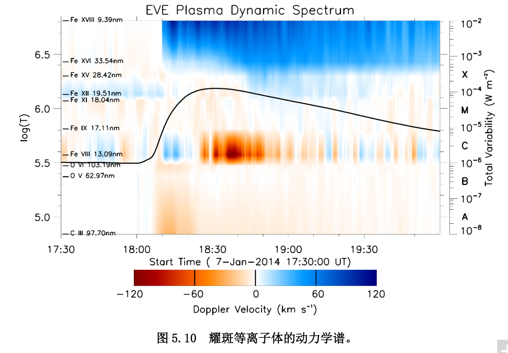

我的理解是：

每个像素内物质的谱线波长偏移都是空间角度的函数（？）不一定

全面叠加：仍为空间角度的函数

 Taylor series 展开到二阶


eg：
活动区辐射占总辐射5%

50km/s

带来总的Doppler shift ~ 2.5km/s


### EVE

#### CHIANTI

[The CHIANTI atomic database (chiantidatabase.org)](https://www.chiantidatabase.org/chianti_linelist.html)

[The CHIANTI atomic database (chiantidatabase.org)](https://www.chiantidatabase.org/chianti_linelist.html)


He II 303.7800 1s 2S1/2 - 2p 2P3/2 4.9 6.50e+05 

He II 303.7860 1s 2S1/2 - 2p 2P1/2 4.9 3.26e+05


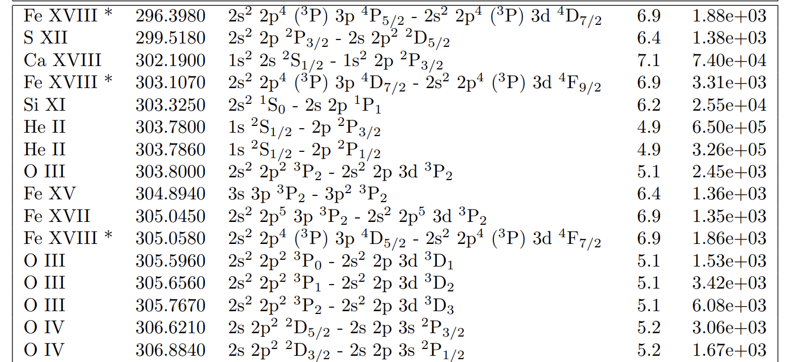


#### level 2 data


```
30.27 30.29 30.31 30.33 30.35 30.37 30.39 30.41 30.43 30.45 30.47
 30.49]
```

12 points

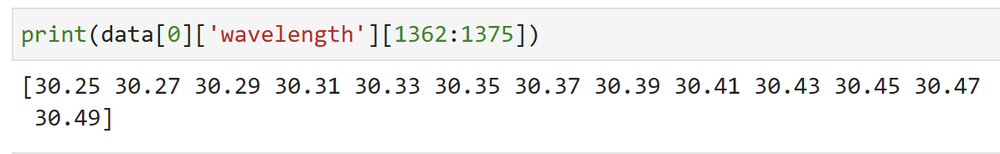


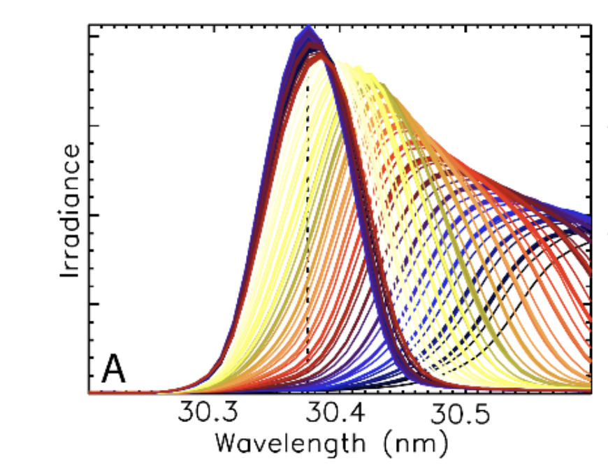


#### article

SDO/AIA response to coronal hole, quiet Sun, active region and flare plasma

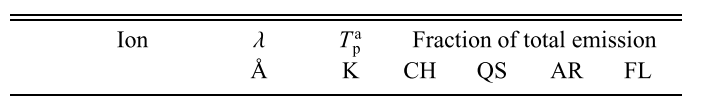

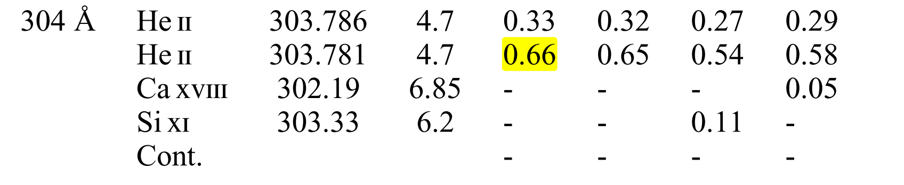

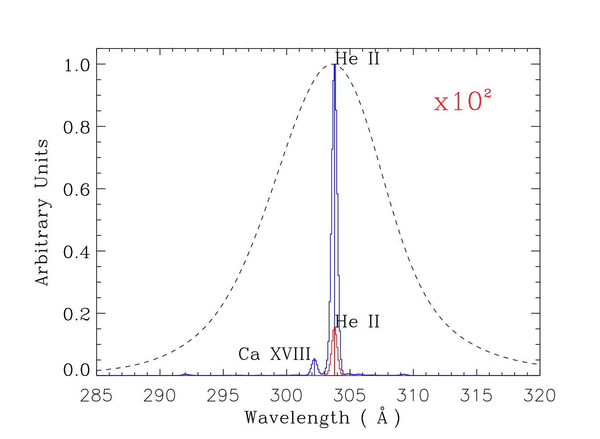


## Gradient Descent

后来还是凭感觉靠肉眼，结果和GD的差不太多.

a=1900， d=0.8，e 不重要 

scipy minimize

https://docs.scipy.org/doc/scipy/reference/generated/scipy.optimize.minimize.html

```python
Type:        OptimizeResult
String form:
fun: 1.0397498709736878e-16
           hess_inv: array([[ 6.75431819e-01,  2.38620072e-01, -2.1811575 <...>   status: 0
           success: True
           x: array([-7.10509671e-09, -6.96428190e-09, -2.23413638e-09])
Length:      10
File:        c:\users\asus-pc\anaconda3\envs\py_begin\lib\site-packages\scipy\optimize\_optimize.py
Docstring:  
Represents the optimization result.

Attributes
----------
x : ndarray
    The solution of the optimization.
success : bool
    Whether or not the optimizer exited successfully.
status : int
    Termination status of the optimizer. Its value depends on the
    underlying solver. Refer to `message` for details.
message : str
    Description of the cause of the termination.
fun, jac, hess: ndarray
    Values of objective function, its Jacobian and its Hessian (if
    available). The Hessians may be approximations, see the documentation
    of the function in question.
hess_inv : object
    Inverse of the objective function's Hessian; may be an approximation.
    Not available for all solvers. The type of this attribute may be
    either np.ndarray or scipy.sparse.linalg.LinearOperator.
nfev, njev, nhev : int
    Number of evaluations of the objective functions and of its
    Jacobian and Hessian.
nit : int
    Number of iterations performed by the optimizer.
maxcv : float
    The maximum constraint violation.

Notes
-----
`OptimizeResult` may have additional attributes not listed here depending
on the specific solver being used. Since this class is essentially a
subclass of dict with attribute accessors, one can see which
attributes are available using the `OptimizeResult.keys` method.
```


### Nealder Mead

```
result.keys()
dict_keys(['fun', 'nit', 'nfev', 'status', 'success', 'message', 'x', 'final_simplex'])

result
message: Optimization terminated successfully.
       success: True
        status: 0
           fun: 5.439288408684259e-07
             x: [ 1.212e+03 -1.130e+00  4.710e+02  6.399e-01 -1.411e-02]
           nit: 278
          nfev: 490
 final_simplex: (array([[ 1.212e+03, -1.130e+00, ...,  6.399e-01,
                        -1.411e-02],
                       [ 1.212e+03, -1.130e+00, ...,  6.399e-01,
                        -1.411e-02],
                       ...,
                       [ 1.212e+03, -1.130e+00, ...,  6.399e-01,
                        -1.411e-02],
                       [ 1.212e+03, -1.130e+00, ...,  6.399e-01,
                        -1.411e-02]]), array([ 5.439e-07,  5.439e-07,  5.439e-07,  5.439e-07,
                        5.439e-07,  5.439e-07]))
```


https://docs.scipy.org/doc/scipy/reference/optimize.minimize-neldermead.html


**initial_simplex**	array_like of shape (N + 1, N)

Initial simplex. If given, overrides *x0*. `initial_simplex[j,:]` should contain the coordinates of the jth vertex of the `N+1` vertices in the simplex, where `N` is the dimension.


## 长期观测   多因素

- 活动区偏轴      无多普勒  

仅仅活动区自转偏轴，引起的光学效应

- 活动区自转导致的多普勒

  1.9 km/sec

- 活动区上升流


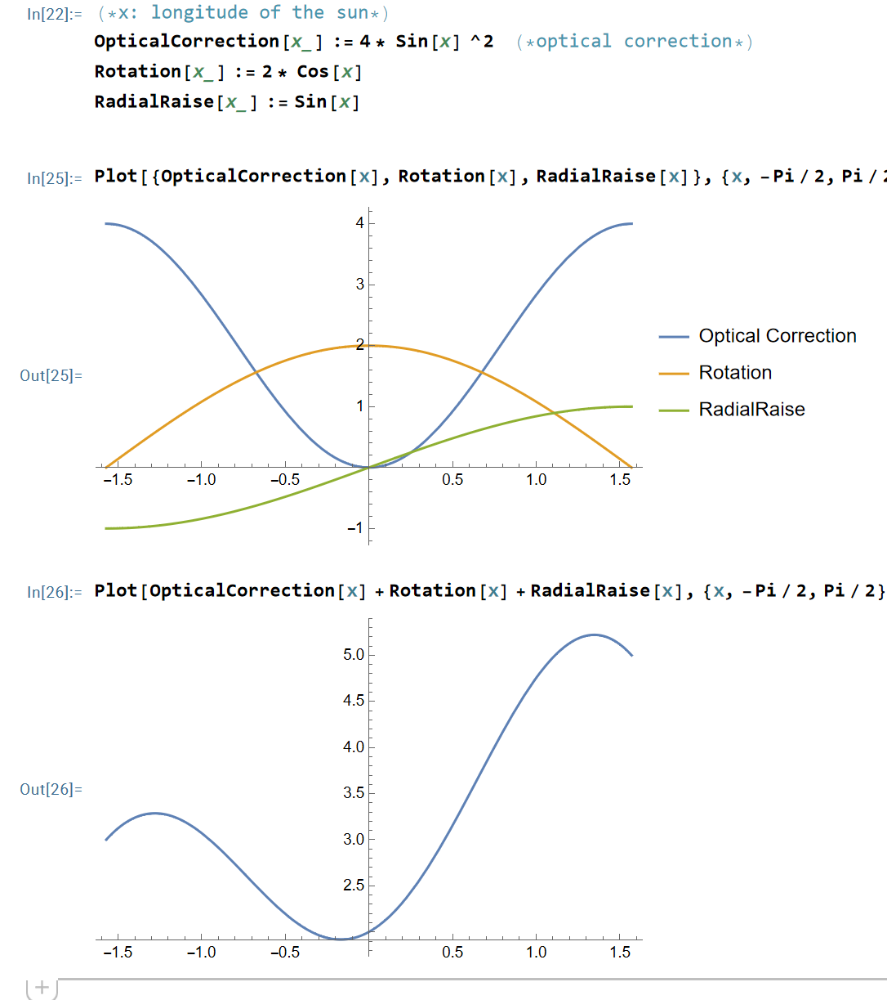


## HMI 

这个速度，是光球层的铁元素的速度吧。

如果我想得到AIA 304 的速度？是不是看这个没有用？

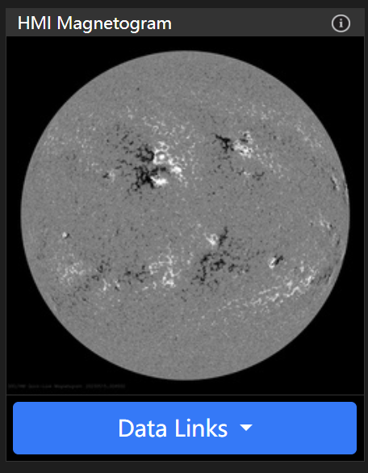

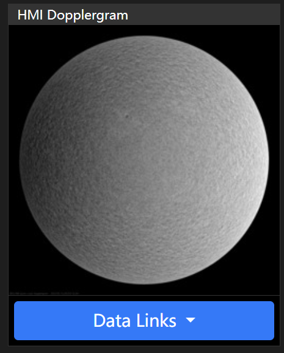


HMI will obtain filtergrams in various positions in the Fe I 617.3 nm spectral line and a set of polarizations at a regular cadence for the duration of the mission.

### data pipeline

http://jsoc.stanford.edu/jsocwiki/Processing?highlight=%28dopplergram%29


## Jhelio viewer

[JHelioviewer User Manual (oma.be)](http://swhv.oma.be/user_manual/)


## 衡量误差

 R-squared is as follows:

https://en.wikipedia.org/wiki/Coefficient_of_determination


## question

why aia only on solar disk?

eve is not only solar disk.....

我就觉得应该全部aia视野啊


### EVE 下载  IDL出错

30%的时间都会出错，大量数据没法得到

% SOCK_ERROR: Status code = 404. URL not found - http://lasp.colorado.edu/eve/data_access/evewebdataproducts/level2/2010/347/EVS_L2_2010347_14_006_02.fit.gz
4097 : http://lasp.colorado.edu/eve/data_access/evewebdataproducts/level2/2010/347/EVS_L2_2010347_15_006_02.fit.gz
IDL> 


```idl
result=vso_search('2011-01-01','2011-01-02 0:00',inst='eve',level=2)
log=vso_get(result,out_dir='data/EVE',filenames=fnames)

end

```


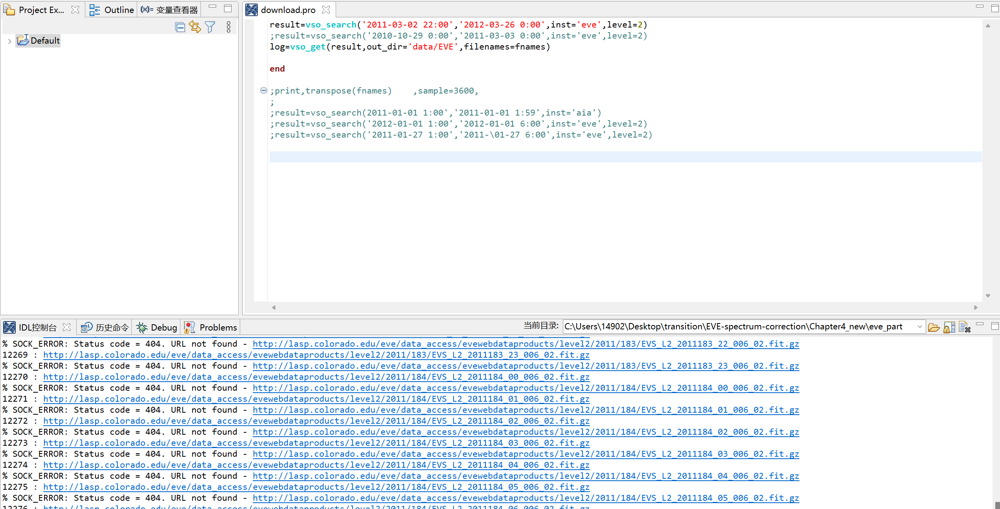

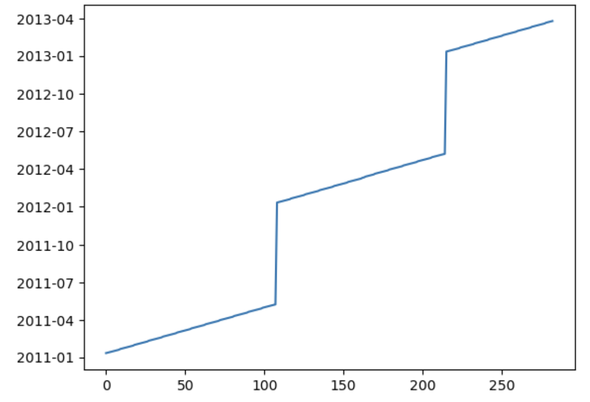


###  FWHM 每天变？

每天的FWHM未必一样

但是先认为每天都一样


```
# define initial values of a, b, c
x0 = np.array([ 8e2,1,100,  8e-1, -1.5e-02])
#([886.81, 0.91002, 0])

# define a callback function to track the optimization process
def callback(x):
    global num_evals
    num_evals += 1
    print(f"Iteration {num_evals}: error_function({x}) = {error_function(x)}")

num_evals = 0
# minimize f using L-BFGS
options = {'xtol': 1e-3}
result = minimize(error_function, x0, callback=callback,options={'maxiter': 1000},
                        method='Nelder-Mead',
                  )

# print the optimal values of a, b, c
print(f"Optimal values: {result.x}")
```


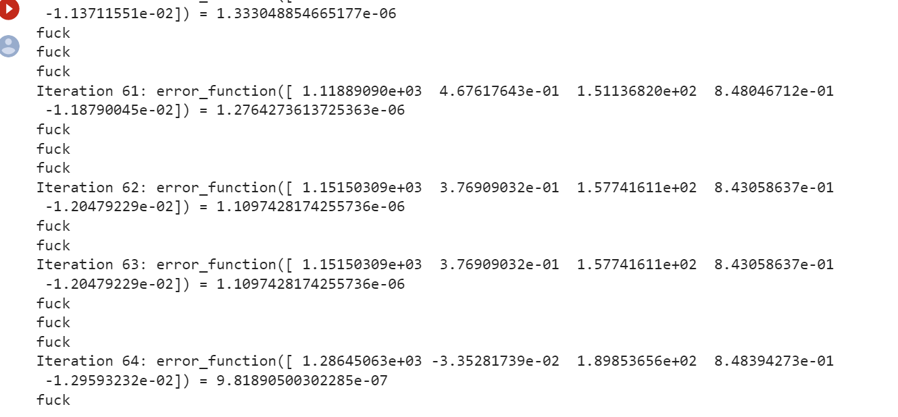


Iteration 133: error_function([ 1.40750218e+03  1.46560362e-02  4.61590071e+02  7.00730540e-01 -1.53866055e-02]) = 5.96788976823164e-07


### 日面内 ？ He？

就这几篇文章都没懂。。。。

SDO/AIA response to coronal hole, quiet Sun, active region and flare plasma

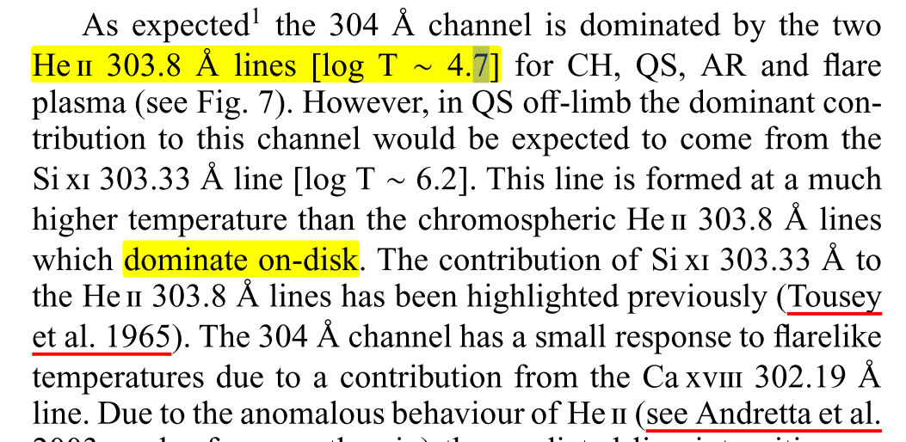


EVE：全部视野 全部波段 的辐射

AIA：

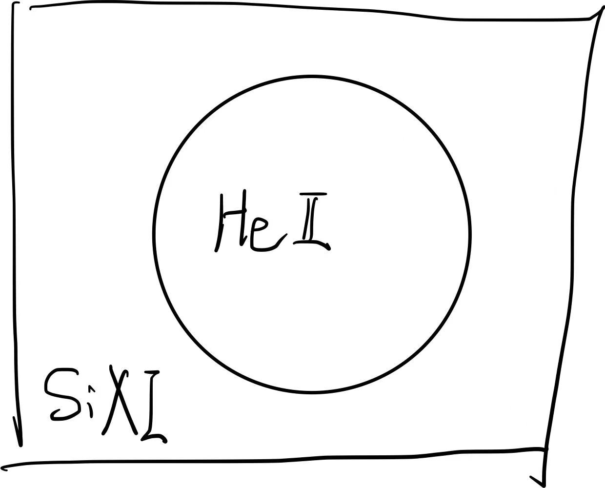


off-limb : 边缘之外是什么意思？光球层之外 日冕算嘛？

我没有看懂如下俩图，我觉得数据对不上？

第一张图，没有哪个线大于90%

第二张图的蓝色He线强度是其他线的100倍以上


### response function

response function 为什么是T的函数？不是波长的函数？？？？？


The Atmospheric Imaging Assembly (AIA) on the Solar Dynamics Observatory (SDO)

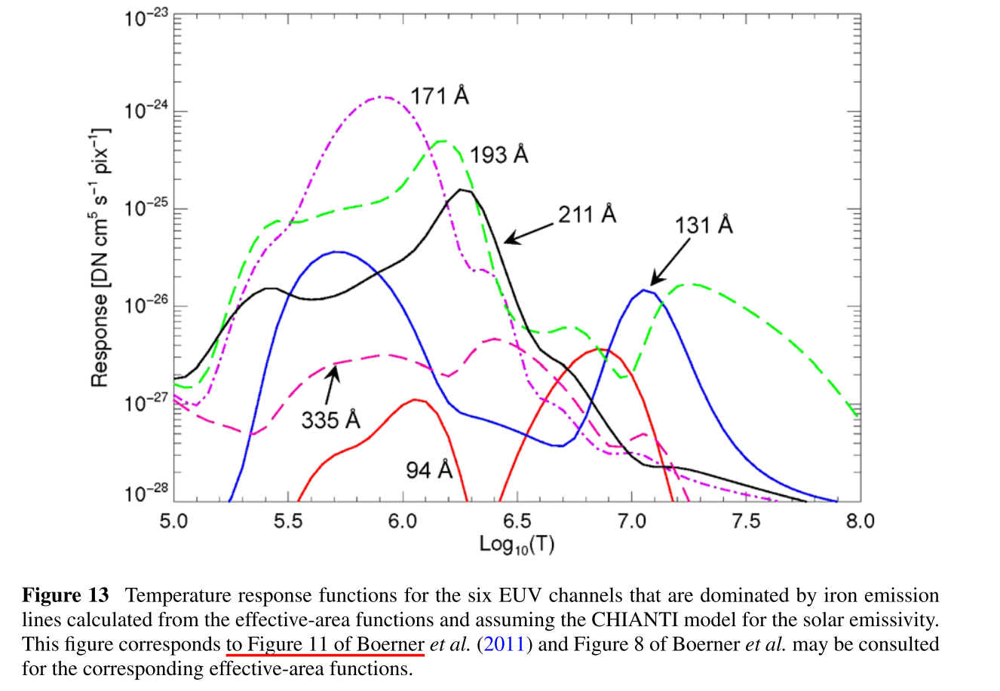


THE SOHO MISSION: AN OVERVIEW

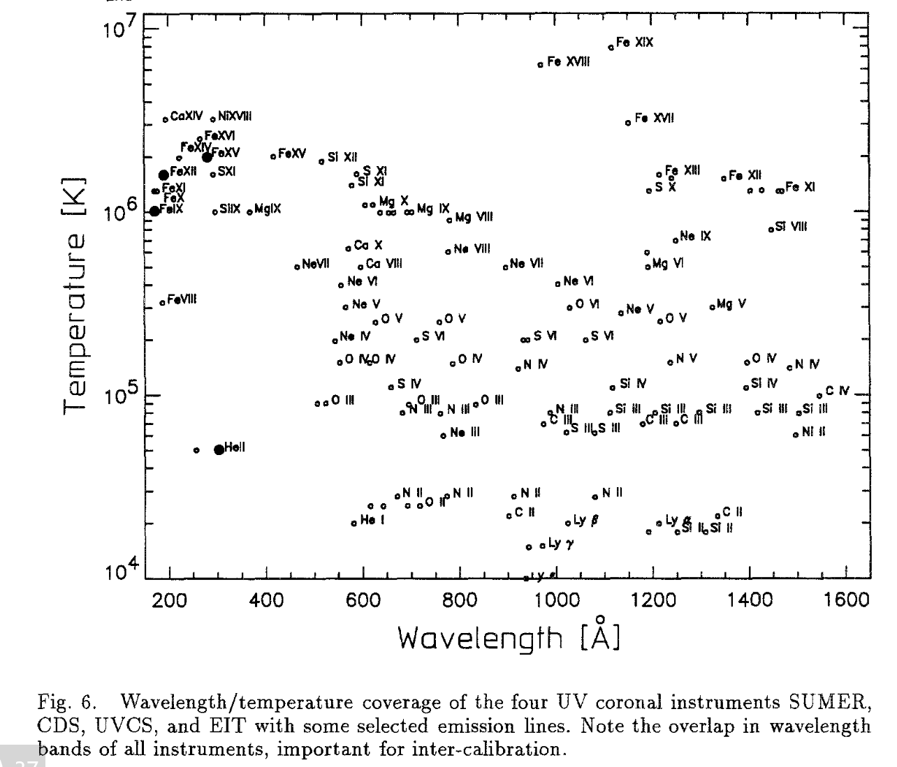


#### spectral response function


[(40条消息) 光谱响应函数相关原理（Spectral Response Function）_火树和冬泳的博客-CSDN博客](https://blog.csdn.net/qq_39626523/article/details/112597557)

Initial Calibration of the Atmospheric Imaging Assembly (AIA) on the Solar Dynamics Observatory (SDO)


The y-axis of an SRF can represent different quantities, such as the ratio of the measured luminance to the incident value (also known as the response or sensitivity), the quantum efficiency, or the radiant sensitivity.


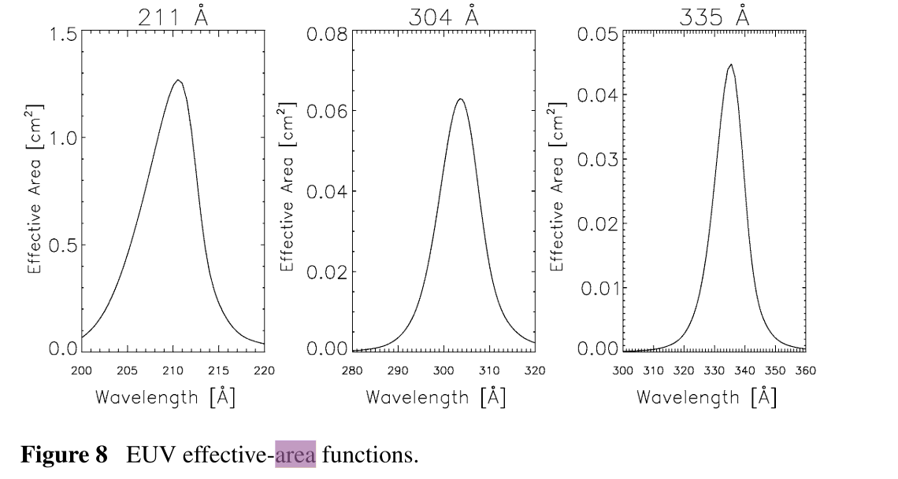

#### correction factor of 20


Due to the anomalous behaviour ofHe ii (see Andretta et al. 2003, and references therein) the predicted line intensities are under-estimated by large factors. 


这段话我完全看不懂？


### AIA 一定准？？

使用了aiapy，使得曝光时间为1s。

但是总辐射量看起来没对，和网站上那个对不上

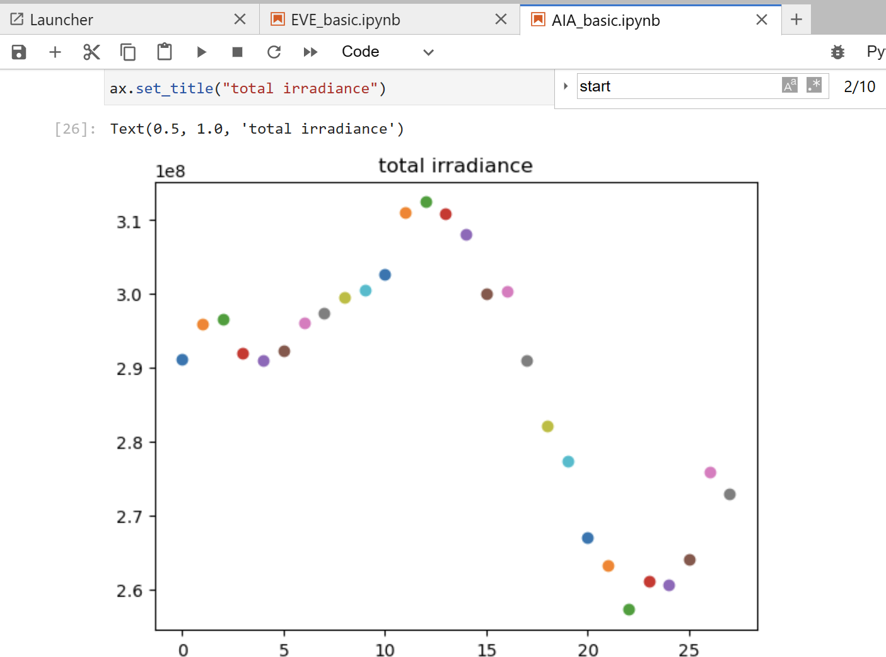

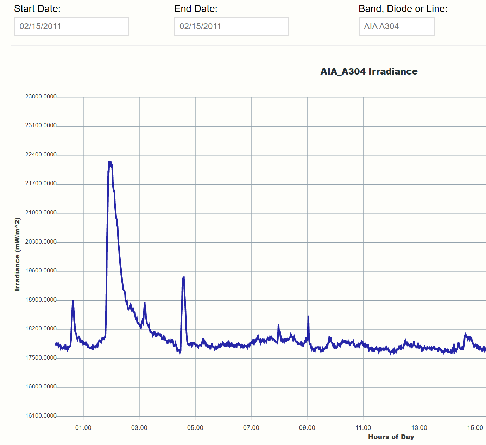

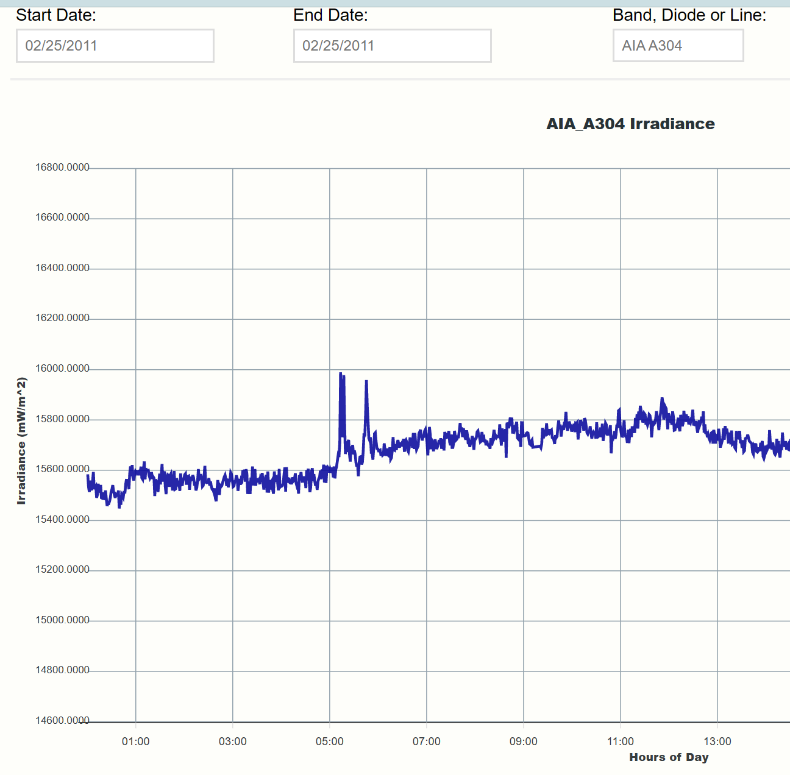

### HMI

what's sound speed map?
